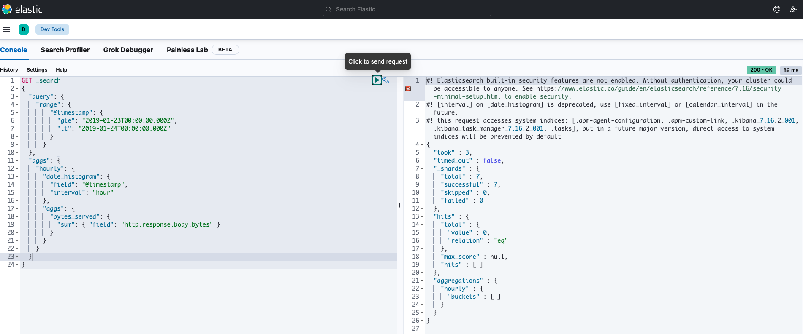

# Data Management and Analysis

As you know, ELK stack is a powerful tool for data management and analysis.

It provides some useful devtools to help you to manage your data.

All of the JSON formatted data in this directory is the input data for the devtools.

